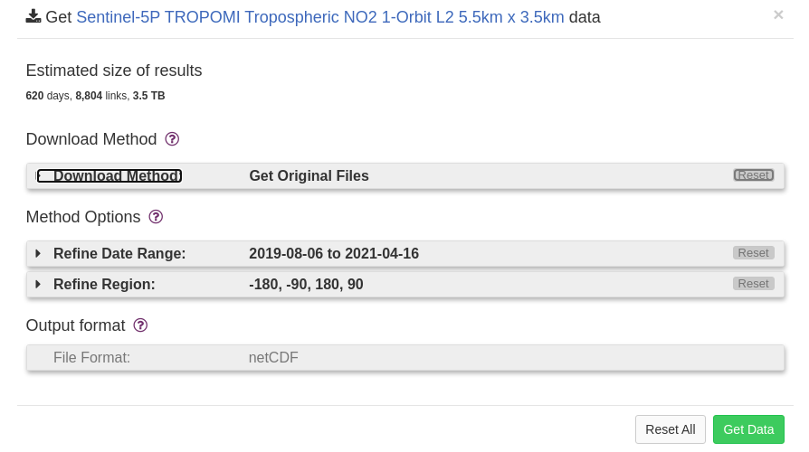
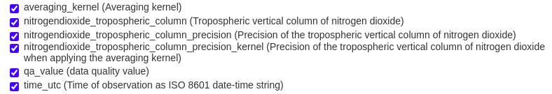
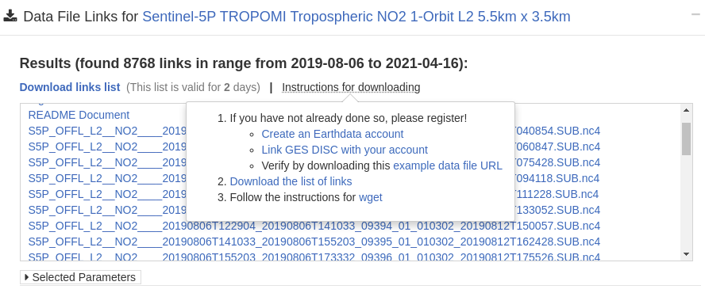

# Analyzing Air Pollution Using Sentinel-5P TROPOMI Data

This Project is Aimed at monitoring the air quality at a particular location using  the data collected by [Sentinel-5p](https://sentinel.esa.int/web/sentinel/user-guides/sentinel-5p-tropomi) TROPOMI satellite. This manual along with the accompanying code will help to do the same for any location.

> This manual is made for a Linux system So for any other Operating systems there maybe some discrepancies


### Requirements

- Anaconda 4.3.0
- Python 3.5

The below packages comes along with anaconda but can be installed using pip if needed

- netcdf4 >= 1.5
- numpy >= 1.19
- pandas >= 1.1
- matplotlib >= 3.3

### Installation

We recommend using `conda` to create and manage a virtual environment when using this set of scripts.

Install Anaconda following this [guide](https://docs.anaconda.com/anaconda/install/).

Create a conda environment using the code given below with all the dependencies already installed.

```bash
conda create --override-channels -c conda-forge -c stcorp --file requirements.txt --name <envname>
conda activate <envname>
```

> Note: While running the scripts If any dependencies error occurs or packages are missing installed the given packages `pip` .

### Downloading Data

##### Setup the Earth-data account and filtering data

The Data is downloaded for Earth-data Website using the [GES-DISC](https://disc.gsfc.nasa.gov/) Portal. You have to first [create an earthdata account](https://wiki.earthdata.nasa.gov/display/EL/How+To+Register+For+an+EarthData+Login+Profile) and [link it to GES-DISC](https://disc.gsfc.nasa.gov/earthdata-login). Once you are registered you should be able to download the data using the following steps.

- Login to the [GES-DISC](https://disc.gsfc.nasa.gov/) Portal.

- Search for TROPOMI in the search box which will list out all the datasets of TROPOMI satellite.

- Go to the `Subset/Get Data` option of the gas whose data you want.

  

- Refine the date and the region according to the region and the time-frame for which you want the data.

- We can change the download method to Get File subset to Refine the components of the total data which you need by selection the variables we want in the variables section. 

  

  ​         **An example of variables we have chosen for the NO2 data.**

- We are only choosing these values to generate the concentration of the concerned gas over the area selected.

- For generating the heat map of an area for a particular day you have to get the whole data set.

- Click on get data which will  generate a list of links for all  the dataset for the given time period.

- To Download all the dataset together download the list of links using the option provided.

  

##### To download the files using wget

A version of wget 1.18 complied with gnuTLS 3.3.3 or OpenSSL 1.0.2 or LibreSSL 2.0.2 or later is recommended

- Create a cookie file. This file will let you download GES DISC resources without having to re-login.

  1. Open a run-command window by pressing Win-Key + R

  2. Next, enter "cmd" in the text field and click "OK"

  3. Navigate to the directory you wish to create the cookies file in. In this guide, we place it under the C drive, but any directory will do. You can navigate to the C drive by entering `C:`

  4. Finally, enter `NUL > .urs_cookies`.
     Note: you may need to re-create .urs_cookies in case you have already executed `wget` without valid authentication.

     > Note: you can get 'Access denied' error. Enter 'dir' to verify that '.urs_cookies' file is listed in your directory.

- To download the files run the following command

  ```bash
  wget --load-cookies C:\.urs_cookies --save-cookies C:\.urs_cookies --auth-no-challenge=on --keep-session-cookies --user=<your username> --ask-password --content-disposition -i <url>
  ```

  <yourusername> the user name of the earth-data account.

  <url> = path to the files containing the list of links.

- The files will be downloaded to the current folder.

### Processing Data

Put the names of the dataset files you want to analyze in the `fileList.txt` file.

##### Study The SDS (Variables) or Content of a particular file.

- This can be done using the script named read_tropomi_and_list_sds.py

- Just follow the instruction given in the scripts and it will list all the variables contained within the file.

  ```python
  def print_var_recursively(grp):
      for varname in list(grp.variables.keys()):
          var = grp.variables[varname]
          dims = var.dimensions
          if not ('scanline' in dims and 'ground_pixel' in dims and 'time' in dims):
              continue
          if 'corner' in dims or varname == 'time_utc':
              continue
         # print(dims['time'])
         # print(varname,dims)
          print(var)
          
  def ncdump(nc_fid, verb=True):
      def print_ncattr(key):
          try:
              print ("\t\ttype:", repr(nc_fid.variables[key].dtype))
              for ncattr in nc_fid.variables[key].ncattrs():
                  print ('\t\t%s:' % ncattr,\
                        repr(nc_fid.variables[key].getncattr(ncattr)))
          except KeyError:
              print ("\t\tWARNING: %s does not contain variable attributes" % key)
  
      # NetCDF global attributes
      nc_attrs = nc_fid.ncattrs()
      if verb:
          print ("NetCDF Global Attributes:")
          for nc_attr in nc_attrs:
              print ('\t%s:' % nc_attr, repr(nc_fid.getncattr(nc_attr)))
      nc_dims = [dim for dim in nc_fid.dimensions]  # list of nc dimensions
      # Dimension shape information.
      if verb:
          print ("NetCDF dimension information:")
          for dim in nc_dims:
              print ("\tName:", dim) 
              print ("\t\tsize:", len(nc_fid.dimensions[dim]))
              print_ncattr(dim)
      # Variable information.
      nc_vars = [var for var in nc_fid.variables]  # list of nc variables
      if verb:
          print ("NetCDF variable information:")
          for var in nc_vars:
              if var not in nc_dims:
                  print ('\tName:', var)
                  print ("\t\tdimensions:", nc_fid.variables[var].dimensions)
                  print ("\t\tsize:", nc_fid.variables[var].size)
                  print_ncattr(var)
      return nc_attrs, nc_dims, nc_vars
  #import necessary modules
  import netCDF4
  from netCDF4 import Dataset
  
  #This finds the user's current path so that all nc files can be found
  try:
      fileList=open('fileList.txt','r')
  except:
      print('Did not find a text file containing file names (perhaps name does not match)')
      sys.exit()
  
  #loops through all files listed in the text file
  for FILE_NAME in fileList:
      FILE_NAME=FILE_NAME.strip()
      user_input=input('\nWould you like to process\n' + FILE_NAME + '\n\n(Y/N)')
      if(user_input == 'N' or user_input == 'n'):
          print('Skipping...')
          continue
      else:
          nc_file = Dataset(FILE_NAME, 'r')   # 'r' means that nc file is open in read-only mode    
          nc_attrs,nc_dims,nc_vars = ncdump(nc_file)
          print_var_recursively (nc_file.groups['PRODUCT'])
      nc_file.close()
  ```


##### Map the spacial pattern of the monitored gas over the area

- This can be done using the script named map_tropomi.py

  ```python
  #!/usr/bin/python
  import os
  os.environ['PROJ_LIB'] = '/home/ksb4/anaconda3/share/proj' # this will be done in anaconda according to the systems variables.
  import numpy as np
  from mpl_toolkits.basemap import Basemap
  import matplotlib.pyplot as plt
  import sys
  from netCDF4 import Dataset
  
  #This finds the user's current path so that all hdf4 files can be found
  try:
      fileList=open('fileList.txt','r')
  except:
      print('Did not find a text file containing file names (perhaps name does not match)')
      sys.exit()
  
  #loops through all files listed in the text file
  for FILE_NAME in fileList:
      FILE_NAME=FILE_NAME.strip()
      user_input=input('\nWould you like to process\n' + FILE_NAME + '\n\n(Y/N)')
      #user_input = 'Y' #uncomment this to run all the files
      if(user_input == 'N' or user_input == 'n'):
          print('Skipping...')
          continue
      else:
          file = Dataset(FILE_NAME, 'r')
  # read the data
          ds=file
          grp='PRODUCT'        
          lat= ds.groups[grp].variables['latitude'][0][:][:]
          lon= ds.groups[grp].variables['longitude'][0][:][:]
          if 'NO2' in FILE_NAME:
              sds_name='nitrogendioxide_tropospheric_column'
              map_label='mol/m2'
          if 'AER_AI' in FILE_NAME:
              sds_name='aerosol_index_354_388'
              map_label='Aerosol Index'
          if 'SO2' in FILE_NAME:
              sds_name='sulfurdioxide_total_vertical_column'
              map_label='mol/m2'
          if 'O3' in FILE_NAME:
              sds_name='ozone_total_vertical_column'
              map_label='mol/m2'
          if 'CO' in FILE_NAME:
              sds_name='carbonmonoxide_total_column'
              map_label='mol/m2'
          data= ds.groups[grp].variables[sds_name]      
          
          #get necessary attributes 
          fv=data._FillValue
          
          #get lat and lon information 
          min_lat=np.min(lat)
          max_lat=np.max(lat)
          min_lon=np.min(lon)
          max_lon=np.max(lon)
          
          # set map labels
          map_label = data.units
          map_title = data.long_name
          print(data.units)
      
          #get the data as an array and mask fill/missing values
          dataArray=np.array(data[0][:][:])
          dataArray[dataArray==fv]=np.nan
          data=dataArray      
          
          #get statistics about data
          average=np.nanmean(dataArray)
          stdev=np.nanstd(dataArray)
          median=np.nanmedian(dataArray)
          map_label='mol/cm2'
          
          #print statistics 
          print('The average of this data is: ',round(average,3),'\nThe standard deviation is: ',round(stdev,3),'\nThe median is: ',round(median,3))
          print('The average of this data is: ','{:.2e}'.format(average),'\nThe standard deviation is: ','{:.2e}'.format(stdev),'\nThe median is: ','{:.2e}'.format(median))
          print('The range of latitude in this file is: ',min_lat,' to ',max_lat, 'degrees \nThe range of longitude in this file is: ',min_lon, ' to ',max_lon,' degrees')
          is_map=input('\nWould you like to create a map of this data? Please enter Y or N \n')
          
          #if user would like a map, view it
          if is_map == 'Y' or is_map == 'y':
              data = np.ma.masked_array(data, np.isnan(data))
              m = Basemap(projection='cyl', resolution='l',
                          llcrnrlat=-90, urcrnrlat = 90,
                          llcrnrlon=-180, urcrnrlon = 180)
              m.drawcoastlines(linewidth=0.5)
              m.drawparallels(np.arange(-90., 120., 30.), labels=[1, 0, 0, 0])
              m.drawmeridians(np.arange(-180, 180., 45.), labels=[0, 0, 0, 1])
              my_cmap = plt.cm.get_cmap('jet')
              my_cmap.set_under('w')
              vmin1=0.0
              vmax1=0.05
              if 'AER_AI' in FILE_NAME:
                  vmin1=-2.0
                  vmax1=0.4
              m.pcolormesh(lon, lat, data, latlon=True, vmin=vmin1, vmax=np.nanmax(data)*vmax1,cmap=my_cmap)
              cb = m.colorbar()
              cb.set_label(map_label)
              plt.autoscale()
              #title the plot
              plt.title('{0}\n {1}'.format(FILE_NAME, map_title))
              fig = plt.gcf()
              # Show the plot window.
              plt.show()
          #once you close the map it asks if you'd like to save it
              is_save=str(input('\nWould you like to save this map? Please enter Y or N \n'))
              if is_save == 'Y' or is_save == 'y':
                  #saves as a png if the user would like
                  pngfile = '{0}.png'.format(FILE_NAME[:-3])
                  fig.savefig(pngfile, dpi = 300)
          #close the hdf5 file 
          file.close()
  ```

  

- For different gases/particles we have to change the SDS variable in the script for the particular gas which is given below with the map label or units in bracket.

  > NO2 - nitrogendioxide_tropospheric_column (mol/ m^2)
  >
  > SO2 - sulfurdioxide_total_vertical_column (mol/ m^2)
  >
  > CO - carbonmonoxide_total_column (mol/ m^2)
  >
  > AEROSOL - aerosol_index_340_380 or aerosol_index_354_388 (aerosol index)
  >
  > O3 - ozone_total_vertical_column (mol/ m^2)
  
  

##### Export the Average Value of a day to csv file

- This can be Done using the script named read_and_export_at_a_location.py

- Change the SDS variable as mentioned above along with all the other variables which are needed in the scripts corresponding to the gas being monitored. The variable names can be confirmed with the SDS scripts and also can be seen in the downloading step when we are selecting the variables.

- By default the script will read all the files in the `fileList.txt` and take the average of the SDS value in all the location contained within the file and export the time series data onto a csv file called `data_val.csv`

  > Note : For different gas we have to do different calculations as mentioned in the papers given in the tropomi portal corresponding to different gases. 
  
  
  
  
  
  ```python
  x  = FILE_NAME.split("_")
  print(x)
  date = x[9][0:8] #change the first index accot the file name
  year = (int)(x[9][0:4])
  mon = (int)(x[9][4:6])
  day = (int)(x[9][6:8])
  date = str(year) + "-"+str(mon)+"-"+str(day)
  ```
  
- Change the above code according to the file name to get the date the first variable of x must be changes according to the file name.

  

  

  ```python
  dataArray=np.array(data[0][:][:])
  dataArray[dataArray==fv]=np.nan
  data=dataArray
              
  #get statistics about data
  average=np.nanmean(dataArray)
  stdev=np.nanstd(dataArray)
  median=np.nanmedian(dataArray)   
  ```

- This calculates the average of all the data of all the coordinates present in the file .

  

  

  ```python
  o3_val = average
  if((not np.isnan(o3_val))):
  print(date)
  print(o3_val)
  DATE_LIST.append(date)
  DATA_LIST.append(o3_val)
  ```

- This adds the value to the DATA_LIST array. we can move this code around different  position to get different data and modify the condition to take the values on only required condition.

  

  

  ```python
  user_lat = 28.65
  user_lon = 77.20
  #user_lat=float(input('\nPlease enter the latitude you would like to analyze (Deg. N): '))
  #user_lon=float(input('Please enter the longitude you would like to analyze (Deg. E): '))
  #Continues to ask for lat and lon until the user enters valid values
  while user_lat < min_lat or user_lat > max_lat:
  	user_lat=float(input('The latitude you entered is out of range. Please enter a valid latitude: '))
  while user_lon < min_lon or user_lon > max_lon:
  	user_lon=float(input('The longitude you entered is out of range. Please enter a valid longitude: '))
                  
              
  ```

- change the longitude and latitude for any particular grid if needed. But It must  be within the valid range present within the file.

  

  

  ```python
  #calculation to find nearest point in data to entered location (haversine formula)
  R=6371000#radius of the earth in meters
  lat1=np.radians(user_lat)
  lat2=np.radians(lat)
  delta_lat=np.radians(lat-user_lat)
  delta_lon=np.radians(lon-user_lon)
  a=(np.sin(delta_lat/2))*(np.sin(delta_lat/2))+(np.cos(lat1))*(np.cos(lat2))*(np.sin(delta_lon/2))*(np.sin(delta_lon/2))
  c=2*np.arctan2(np.sqrt(a),np.sqrt(1-a))
  d=R*c
  #gets (and then prints) the x,y location of the nearest point in data to entered location, accounting for no data values
  x,y=np.unravel_index(d.argmin(),d.shape)
  print(x,y)
  print('\nThe nearest pixel to your entered location is at: \nLatitude:',lat[x,y],' Longitude:',lon[x,y])
  if np.isnan(dataArray[x,y]):
      print('The value of ',SDS_NAME,'at this pixel is','{:.2e}'.format(fv[0]),',(No Value)\n')
  elif dataArray[x,y] != fv:
      print('The value of ', SDS_NAME, 'at this pixel is ','{:.2e}'.format(dataArray[x,y]))
  #print(no2_value)
  #calculates mean, median, stdev in a 3x3 grid around nearest point to entered location
  if x < 1:
      x+=1
  if x > dataArray.shape[0]-2:
      x-=2
  if y < 1:
      y+=1
  if y > dataArray.shape[1]-2:
      y-=2
  three_by_three=dataArray[x-1:x+2,y-1:y+2]
  three_by_three=three_by_three.astype(float)
  three_by_three[three_by_three==float(fv)]=np.nan
  nnan=np.count_nonzero(~np.isnan(three_by_three))
  if nnan == 0:
      print ('There are no valid pixels in a 3x3 grid centered at your entered location.')
  else:
      three_by_three_average=np.nanmean(three_by_three)
      three_by_three_std=np.nanstd(three_by_three)
      three_by_three_median=np.nanmedian(three_by_three)
      if nnan == 1:
          npixels='is'
          mpixels='pixel'
      else:
          npixels='are'
          mpixels='pixels'
      DL2.append([date, three_by_three_average*10000])
      print('There',npixels,nnan,'valid',mpixels,'in a 3x3 grid centered at your entered location.')
      print('The average value in this grid is: ','{:.2e}'.format(three_by_three_average),' \nThe median value in this grid is: ','{:.2e}'.format(three_by_three_median),'\nThe standard deviation in this grid is: ','{:.2e}'.format(three_by_three_std))
  
  #calculates mean, median, stdev in a 5x5 grid around nearest point to entered location
  if x < 2:
      x+=1
  if x > dataArray.shape[0]-3:
      x-=1
  if y < 2:
      y+=1
  if y > dataArray.shape[1]-3:
      y-=1
  five_by_five=dataArray[x-2:x+3,y-2:y+3]
  five_by_five=five_by_five.astype(float)
  five_by_five[five_by_five==float(fv)]=np.nan
  nnan=np.count_nonzero(~np.isnan(five_by_five))
  if nnan == 0:
      print ('There are no valid pixels in a 5x5 grid centered at your entered location. \n')
  else:
      five_by_five_average=np.nanmean(five_by_five)
      five_by_five_std=np.nanstd(five_by_five)
      five_by_five_median=np.nanmedian(five_by_five)
      if nnan == 1:
          npixels='is'
          mpixels='pixel'
      else:
          npixels='are'
          mpixels='pixels'
      print('\nThere',npixels,nnan,' valid',mpixels,' in a 5x5 grid centered at your entered location. \n')
      print('The average value in this grid is: ','{:.2e}'.format(five_by_five_average),' \nThe median value in this grid is: ','{:.2e}'.format(five_by_five_median),'\nThe standard deviation in this grid is: ','{:.2e}'.format(five_by_five_std))
      print('The average value in this grid is: ',round(five_by_five_average,3),' \nThe median value in this grid is: ',round(five_by_five_median,3),'\nThe standard deviation in this grid is: ',round(five_by_five_std,3))
   
  ```

- This is used to calculate the SDS value at a particular location , average of the 3x3 grid present around the location and average of 5x5 grids present around the location. We can take these value in the DATA_LIST to export to the csv for a more condensed analysis.

  

  

  ```python
  LEN = len(DATE_LIST)
  #print(len(DATE_LIST))
  #print(len(DATA_LIST))
  for j in range (LEN):
      print(DATE_LIST[j],"  ", DATA_LIST[j])
  #print(DATA_LIST);
  df = pd.DataFrame(DATA_LIST, index = DATE_LIST)
  df.info()
  df.index = pd.to_datetime(df.index)
  df.info()
  print(df.head())
  df.to_csv('data_val.csv')
  ```

- Lastly this is used for viewing and exporting the data to a csv for further analysis.

##### Plotting the time series graph

- This can be done using the script plot_graph.py .

- Change the labels, colors and pattern and any other properties according to our needs .

  ```python
  ax.scatter(df.index.values,
          df['0'],
          color='purple')
  ```

  for scatter plot

  ```python
  ax.plot(df.index.values,
           df['0'],
           color='purple')
  ```

  for line plot

  
