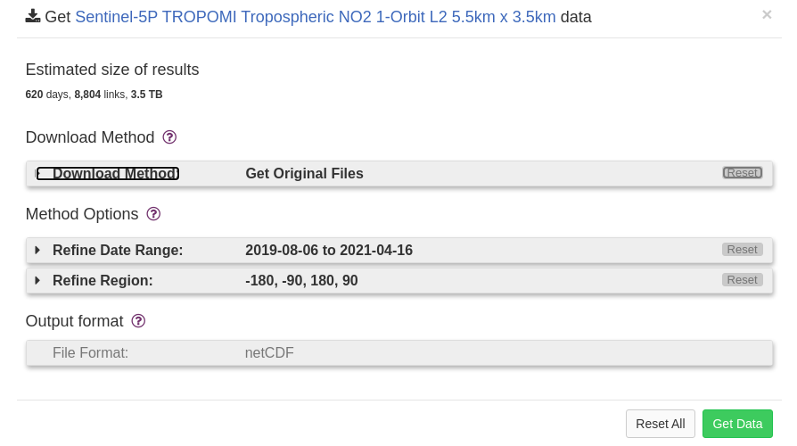
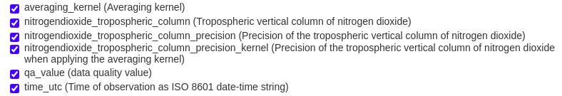
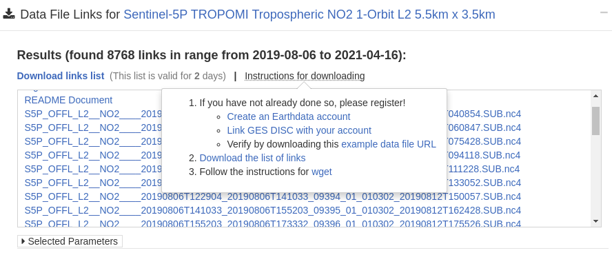

# Analyzing Air Pollution Using Sentinel-5P TROPOMI Data

This Project is Aimed at monitoring the air quality at a particular location using  the data collected by [Sentinel-5p](https://sentinel.esa.int/web/sentinel/user-guides/sentinel-5p-tropomi) TROPOMI satellite. This manual along with the accompanying code will help to do the same for any location.

> This manual is made for a Linux system So for any other Operating systems there maybe dome discrepancies

[Detailed Manual](/README/Manual.md)

### Requirements

- Anaconda 4.3.0
- Python 3.5

The below packages comes along with anaconda but can be installed using pip if needed

- netcdf4 >= 1.5
- numpy >= 1.19
- pandas >= 1.1
- matplotlib >= 3.3

### Installation

We recommend using `conda` to create and manage a virtual environment when using this set of scripts.

Install Anaconda following this [guide](https://docs.anaconda.com/anaconda/install/).

Create a conda environment using the code given below with all the dependencies already installed.

```bash
conda create --override-channels -c conda-forge -c stcorp --file requirements.txt --name <envname>
conda activate <envname>
```

> Note: While running the scripts If any dependencies error occurs or packages are missing installed the given packages `pip` .

### Downloading Data

##### Setup the Earth-data account and filtering data

The Data is downloaded for Earth-data Website using the [GES-DISC](https://disc.gsfc.nasa.gov/) Portal. You have to first [create an earthdata account](https://wiki.earthdata.nasa.gov/display/EL/How+To+Register+For+an+EarthData+Login+Profile) and [link it to GES-DISC](https://disc.gsfc.nasa.gov/earthdata-login). Once you are registered you should be able to download the data using the following steps.

- Login to the [GES-DISC](https://disc.gsfc.nasa.gov/) Portal.

- Search for TROPOMI in the search box which will list out all the datasets of TROPOMI satellite.

- Go to the `Subset/Get Data` option of the gas whose data you want.

  

- Refine the date and the region according to the region and the time-frame for which you want the data.

- We can change the download method to Get File subset to Refine the components of the total data which you need by selection the variables we want in the variables section. 

  

  An example of variables we have chosen for the NO2 data.

- We are only choosing these values to generate the concentration of the concerned gas over the area selected.

- For generating the heat map of an area for a particular day you have to get the whole data set.

- Click on get data which will  generate a list of links for all  the dataset for the given time period.

- To Download all the dataset together download the list of links using the option provided.

  

##### To download the files using wget

A version of wget 1.18 complied with gnuTLS 3.3.3 or OpenSSL 1.0.2 or LibreSSL 2.0.2 or later is recommended

- Create a cookie file. This file will let you download GES DISC resources without having to re-login.

  1. Open a run-command window by pressing Win-Key + R

  2. Next, enter "cmd" in the text field and click "OK"

  3. Navigate to the directory you wish to create the cookies file in. In this guide, we place it under the C drive, but any directory will do. You can navigate to the C drive by entering `C:`

  4. Finally, enter `NUL > .urs_cookies`.
     Note: you may need to re-create .urs_cookies in case you have already executed `wget` without valid authentication.

     > Note: you can get 'Access denied' error. Enter 'dir' to verify that '.urs_cookies' file is listed in your directory.

- To download the files run the following command

  ```bash
  wget --load-cookies C:\.urs_cookies --save-cookies C:\.urs_cookies --auth-no-challenge=on --keep-session-cookies --user=<your username> --ask-password --content-disposition -i <url>
  ```

  <yourusername> the user name of the earth-data account.

  <url> = path to the files containing the list of links.

- The files will be downloaded to the current folder.

### Processing Data

Put the names of the dataset files you want to analyze in the `fileList.txt` file.

##### Study The SDS (Variables) or Content of a particular file.

- This can be done using the script named read_tropomi_and_list_sds.py
- Just follow the instruction given in the scripts and it will list all the variables contained within the file.

##### Map the spacial pattern of the monitored gas over the area

-   This can be done using the script named map_tropomi.py

- For different gases/particles we have to change the SDS variable in the script for the particular gas which is given below with the map label or units in bracket.

  > NO2 - nitrogendioxide_tropospheric_column (mol/ m^2)
  >
  > SO2 - sulfurdioxide_total_vertical_column (mol/ m^2)
  >
  > CO - carbonmonoxide_total_column (mol/ m^2)
  >
  > AEROSOL - aerosol_index_340_380 or aerosol_index_354_388 (aerosol index)
  >
  > O3 - ozone_total_vertical_column (mol/ m^2)

##### Export the Average Value of a day to csv file

- This can be Done using the script named read_and_export_at_a_location.py

- Change the SDS variable as mentioned above along with all the other variables which are needed in the scripts corresponding to the gas being monitored. The variable names can be confirmed with the SDS scripts and also can be seen in the downloading step when we are selecting the variables.

- By default the script will read all the files in the `fileList.txt` and take the average of the SDS value in all the location contained within the file and export the time series data onto a csv file called `data_val.csv`

  > Note : For different gas we have to do different calculations as mentioned in the papers given in the tropomi portal corresponding to different gases. 

##### Plotting the time series graph

- This can be done using the script plot_graph.py .
- Change the labels, colors and pattern and any other properties according to our needs .